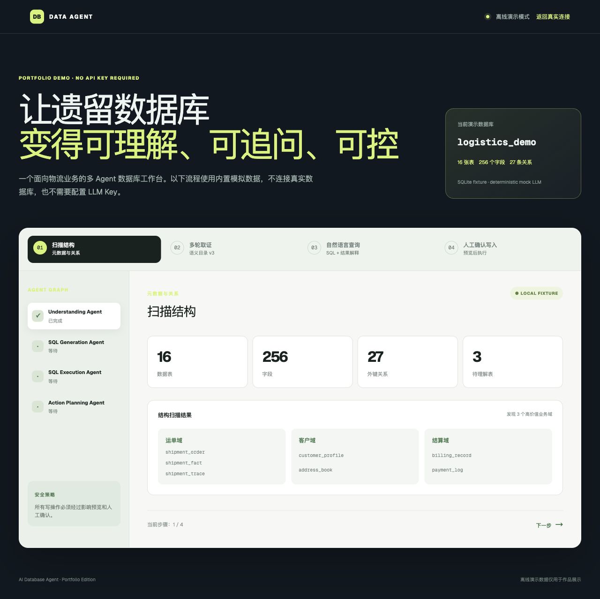
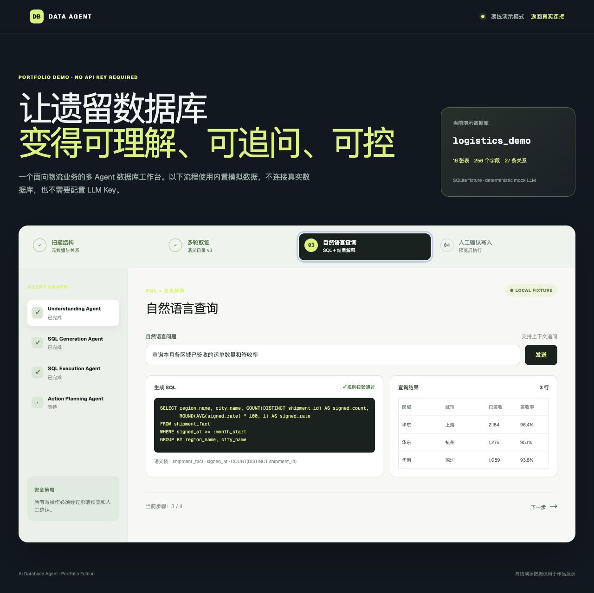
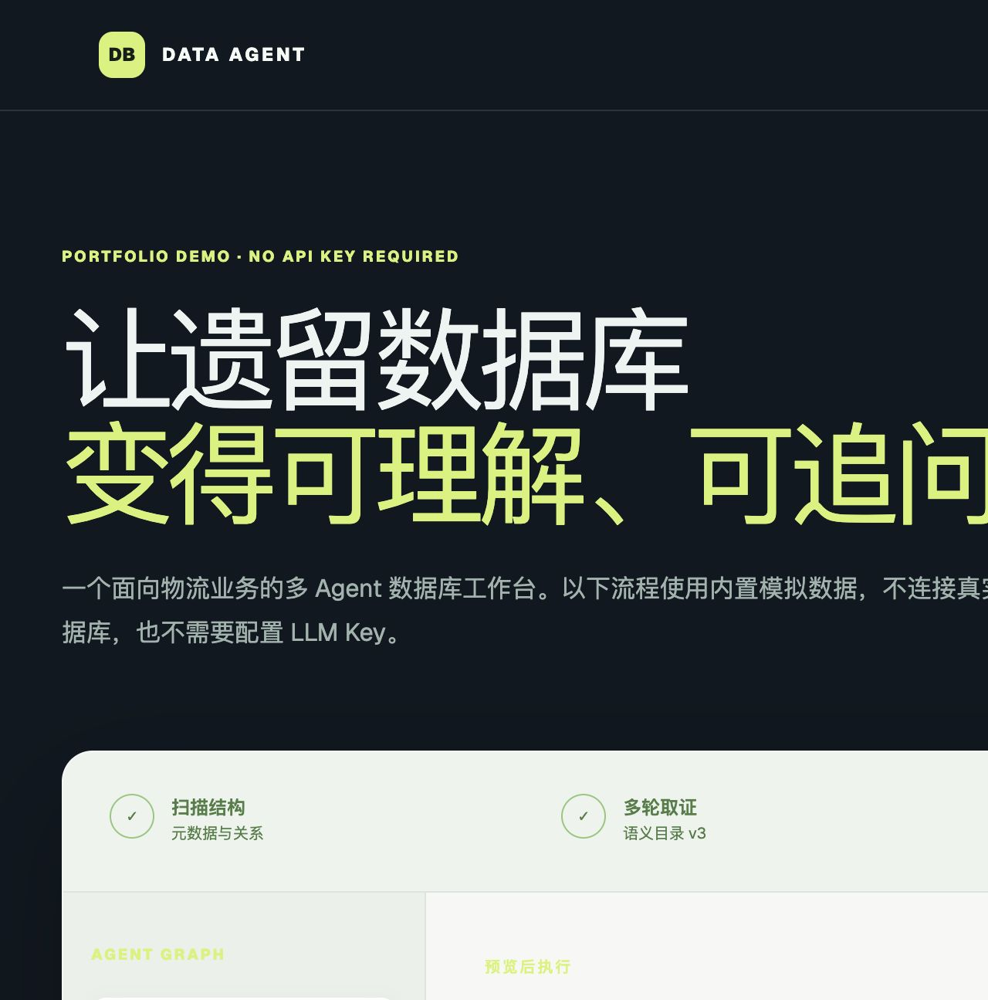

# Enterprise AI Portfolio

这里放了我做的三个企业场景项目。它们不是同一个系统的三个页面，而是三条相对独立的业务链路：

1. 从遗留数据库里找到能用的数据；
2. 对一家企业做信息检索和风险整理；
3. 从公司文档中检索制度，并给出带出处的回答。

三个项目共用一套本地启动脚本，但代码、依赖和数据库相互隔离。

## 先看功能结果

数据库项目的离线演示已经准备了完整的物流数据，可以直接看到扫描结果、查询结果和写操作确认：





这三张图分别对应：看懂表结构、问出数据、确认一次有影响范围的更新。其他两个项目的截图不会用空白首页代替，等外部数据和问答流程跑通后再补入。

## 一、AI Database Agent

### 解决什么问题

物流公司的数据库里有客户、运单、网点、费用等表，但字段命名和注释并不总是能直接看懂。业务人员通常只能提出“上个月各区域完成了多少单”这类问题，不能自己写 SQL，也不应该让模型直接修改生产数据。

### 目前可以做什么

| 功能 | 实际行为 | 结果 |
| --- | --- | --- |
| 数据库理解 | 扫描表、字段、外键和少量真实行 | 生成表用途、字段含义和证据记录 |
| 语义审核 | 对模型生成的语义目录逐项确认 | 发布一个有版本的语义目录 |
| 自然语言查询 | 输入业务问题，生成结构化语义帧和 SQL | 执行查询并返回表格结果 |
| 上下文追问 | 把历史问题、语义版本和上一次查询结果带入下一轮 | 可以继续问“那华东呢”这类问题 |
| 安全写操作 | 先生成 Action Plan 和影响预览 | 用户确认后才进入事务执行 |

### 一次查询怎么走

```text
用户问题
  → Understanding 读取语义目录和对话上下文
  → SQL Generation 输出结构化语义帧
  → 代码规则检查表、字段、SQL 类型和危险操作
  → 执行 SQL
  → 将 SQL、结果和上下文写回会话
```

写操作会多四步：

```text
Action Plan → 影响行预览 → 用户确认 → 事务执行 / 回滚
```

### 代码入口

- 后端：`projects/ai-database-agent/backend/app/`
- 前端：`projects/ai-database-agent/frontend/`
- 数据库脚本：`projects/ai-database-agent/DB/`
- 离线演示说明：[`docs/portfolio/README.md`](projects/ai-database-agent/docs/portfolio/README.md)

技术栈：Python、FastAPI、React、TypeScript、LangGraph、SQLAlchemy、DeepSeek。数据库适配器包含 MySQL、PostgreSQL、SQL Server 和 Oracle。

## 二、企信雷达

### 解决什么问题

做企业尽调时，先要确认“查的是哪一家企业”，再查工商登记、经营状态、被执行人、失信、股权和其他风险信息。直接把搜索结果交给模型会有同名企业误判和评分不可解释的问题。

### 目前可以做什么

| 功能 | 实际行为 | 结果 |
| --- | --- | --- |
| 企业搜索 | 通过 MCP 企业信息服务搜索名称或简称 | 返回候选企业列表，不自动选第一条 |
| 主体确认 | 人工选择统一社会信用代码 | 后续查询固定到已确认主体 |
| 风险扫描 | 并发调用工商、股权、司法等风险工具 | 形成结构化风险因子和条目数 |
| 初步评分 | 由代码中的规则表计算风险分 | 给出风险等级、命中原因和待核查项 |
| 报告输出 | 将结构化结果交给报告层 | 导出 JSON 和 PDF |

### 风险分怎么算

评分不是模型自由生成的。例如“被执行人”“失信信息”“经营异常”等因子有明确的规则分值；未纳入规则的因子会进入“待核查”，不会被悄悄算成高风险。README 不展示线上查询结果，避免把第三方接口返回内容误当成固定数据。

### 代码入口

- 页面：`projects/enterprise-radar/app.py`
- MCP 客户端：`projects/enterprise-radar/services/qcc_client.py`
- 评分规则：`projects/enterprise-radar/services/risk_scoring.py`
- 报告生成：`projects/enterprise-radar/services/report_service.py`

技术栈：Python、Streamlit、MCP、httpx、ReportLab、DeepSeek。

边界：企查查 MCP 服务需要本机配置权限；没有权限时页面应显示错误，不会伪造企业数据。

## 三、Enterprise Knowledge Agent

### 解决什么问题

公司制度、员工手册和业务文档通常是 PDF、Markdown、TXT 等文件。单纯关键词搜索很难把多份制度拼起来，直接让模型回答又无法说明依据在哪里。

### 目前可以做什么

| 功能 | 实际行为 | 结果 |
| --- | --- | --- |
| 知识库管理 | 创建知识库并隔离文档 | 每次问答限定在当前知识库 |
| 文档入库 | 上传 PDF、Markdown、TXT | 解析、切片、向量化并记录处理状态 |
| 混合检索 | 在 pgvector 和文本索引中找相关片段 | 返回相似度和原文片段 |
| Agent 问答 | 受控 Agent 选择检索工具后组织答案 | 回答带来源编号和 Agent Trace |
| 失败处理 | 文档解析失败可重试，检索不到资料时拒答 | 不用模型补造引用 |

### 一次问答怎么走

```text
上传文档
  → 文本解析 / 切片 / embedding
  → 用户提问
  → Agent 判断意图并调用知识库检索
  → 组合多个片段
  → 返回回答、来源片段和工具调用轨迹
```

### 代码入口

- Web：`projects/enterprise-knowledge-agent/apps/web/`
- API：`projects/enterprise-knowledge-agent/services/agent-api/`
- 文档处理：`services/agent-api/app/services/document_processing.py`
- Agent：`services/agent-api/app/agent/`
- 样例语料：[`samples/enterprise_corpus`](projects/enterprise-knowledge-agent/samples/enterprise_corpus/)

技术栈：FastAPI、Next.js、PostgreSQL、pgvector、Ollama、DeepSeek。

## 三个项目放在一起的原因

它们对应企业内部最常见的三类信息：

| 信息类型 | 项目 | 最终产出 |
| --- | --- | --- |
| 结构化数据 | AI Database Agent | 可追溯语义目录、查询表格、确认后的数据库操作 |
| 外部企业信息 | 企信雷达 | 风险因子、规则分数、JSON / PDF 报告 |
| 内部非结构化文档 | Knowledge Agent | 带原文引用的回答和 Agent Trace |

共同点不是“都调用了大模型”，而是模型只负责理解和组织，数据范围、SQL 校验、评分和执行边界由代码控制。

## 本地运行

要求：Node.js 22+、Python 3.12+、uv、Docker Desktop。

```bash
./scripts/start-all.sh
./scripts/status.sh
```

| 服务 | 地址 |
| --- | --- |
| 作品展示站 | http://localhost:3000 |
| AI Database Agent 离线演示 | http://localhost:3101/demo |
| 企信雷达 | http://localhost:3102 |
| Knowledge Agent | http://localhost:3103 |

停止应用（不删除数据库卷）：

```bash
./scripts/stop-all.sh
```

本地启动器会安装依赖、启动 MySQL / PostgreSQL，并运行 Knowledge Agent 的迁移。API Key、数据库密码和第三方服务地址只放在本机 `.env`，不会提交到仓库。

## 目录

```text
enterprise-ai-portfolio/
├── README.md
├── site/                  # 作品展示站
├── projects/
│   ├── ai-database-agent/
│   ├── enterprise-radar/
│   └── enterprise-knowledge-agent/
└── scripts/               # start / status / stop
```

## 公开仓库边界

- 演示数据是模拟或脱敏数据，不连接生产数据库。
- 不提交 `.env`、API Key、真实企业数据、真实文档和数据库运行目录。
- 企信雷达的第三方数据可用性取决于本机 MCP 配置；无法调用时应明确报错。
