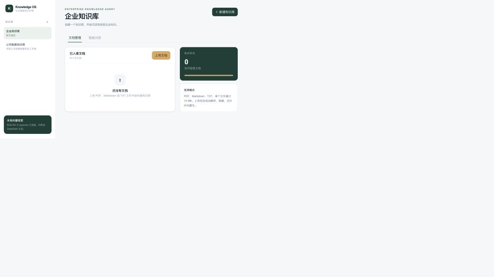

# Enterprise AI Portfolio

一个面向企业真实工作流的 AI 应用作品集：把结构化数据库、外部企业信息和内部知识库，分别做成三个可运行、可解释、可审计的应用。

如果你是面试官，可以先看下面的业务闭环和截图，再按项目链接深入源码；不需要先配置数据库或阅读完整代码。

> 演示数据均为模拟或脱敏数据。仓库不包含 API Key、数据库密码、数据库运行数据、向量库或本机依赖目录。

## 先看结果

| 项目 | 解决的问题 | 入口 |
| --- | --- | --- |
| **AI Database Agent** | 业务人员看不懂遗留库、不会写 SQL | [项目源码](projects/ai-database-agent/) · [离线演示说明](projects/ai-database-agent/docs/portfolio/README.md) |
| **企信雷达** | 企业尽调信息分散、风险判断难以复核 | [项目源码](projects/enterprise-radar/) |
| **Enterprise Knowledge Agent** | 企业文档分散，问答缺少证据和引用 | [项目源码](projects/enterprise-knowledge-agent/) |

三个项目的共同工程主线是：

```text
真实数据 / 文档取证 → 受控 Agent 编排与工具调用 → 可解释结果、人工确认与审计边界
```

## 项目截图

### AI Database Agent：从数据库理解到安全操作


### 企信雷达：企业主体检索与风险扫描


### Enterprise Knowledge Agent：知识库文档与检索问答



## 01 · AI Database Agent

### 业务背景

企业遗留数据库常见字段缺少注释、缩写严重、表关系不完整。业务人员无法直接理解数据，更无法稳定地把问题翻译成 SQL；只看 Schema 的模型还容易把字段含义猜错。

### 业务闭环

```text
扫描 Schema
  → 结合样例数据进行有限轮次取证
  → 生成可追溯语义目录并支持人工审核
  → 自然语言查询 / 上下文追问
  → 写操作生成 Action Plan
  → 影响预览 → 用户确认 → 事务执行
```

### 关键实现

- Understanding、SQL Generation、Intent Router、Action Planning 等角色通过结构化状态协作。
- 语义帧约束模型输出，代码规则二次校验 SQL 类型、表范围、字段范围和危险操作。
- Adapter + SQL Dialect 抽象 MySQL、PostgreSQL、SQL Server、Oracle 的连接和方言差异。
- 查询会把上下文、语义版本和真实结果一起交给后续对话，不靠前端自定义关键词切换语境。

技术栈：Python、FastAPI、React、TypeScript、LangGraph、DeepSeek、SQLAlchemy。

- [源码](projects/ai-database-agent/)
- [作品展示版与录屏素材](projects/ai-database-agent/docs/portfolio/README.md)
- 本地体验：`http://localhost:3101/demo`

## 02 · 企信雷达

### 业务背景

企业尽调通常需要在多个信息源之间反复检索。人工流程耗时，而且风险结论容易缺少统一口径，难以沉淀成可交付报告。

### 业务闭环

```text
输入企业名称
  → 搜索并确认唯一企业主体
  → 并发获取工商与风险信息
  → 确定性规则生成风险项与评分
  → AI 汇总分析
  → 导出 JSON / PDF 报告
```

### 关键实现

- 先确认企业主体，再执行后续查询，减少同名企业误判。
- 外部信息通过工具层聚合，规则评分与模型分析分层，风险结论可追溯。
- 报告生成使用结构化结果，不把模型文本直接当作评分依据。

技术栈：Python、Streamlit、MCP、httpx、DeepSeek、ReportLab。

- [源码](projects/enterprise-radar/)
- 本地体验：`http://localhost:3102`
- 边界：外部数据可用性取决于企查查 MCP 权限，规则评分不替代专业尽调。

## 03 · Enterprise Knowledge Agent

### 业务背景

企业制度、服务手册和流程文档分散在不同位置。普通关键词搜索无法组合证据，直接让模型回答又容易脱离原文，无法让使用者复核。

### 业务闭环

```text
创建知识库
  → 上传 TXT / Markdown / PDF
  → 解析、切片与向量化
  → 受控 Agent 选择检索工具
  → 返回带原文引用的答案与 Agent Trace
```

### 关键实现

- 文档处理状态、内容哈希和切片结果可追踪，避免重复处理。
- Agent 只能在当前知识库边界内检索，资料不足时明确拒答，不补造引用。
- 混合检索结合 PostgreSQL / pgvector 与文本匹配，回答附带证据片段。

技术栈：Python、FastAPI、Next.js、PostgreSQL、pgvector、Ollama、DeepSeek。

- [源码](projects/enterprise-knowledge-agent/)
- [样例企业语料](projects/enterprise-knowledge-agent/samples/enterprise_corpus/)
- 本地体验：`http://localhost:3103`

## 我在这个作品集里重点展示什么

- **Agent 编排**：把模型放在理解、规划和工具选择的位置，把状态转移和执行边界交给代码。
- **安全执行**：NL2SQL 经过结构化输出和规则校验；数据库写操作必须经过影响预览和人工确认。
- **可解释性**：语义目录保留证据，企业风险保留规则项，知识库问答保留原文引用和 Agent Trace。
- **工程化**：三个项目在一个仓库中统一启动，端口、环境变量、数据库容器和迁移脚本相互隔离。

## 目录结构

```text
enterprise-ai-portfolio/
├── README.md
├── site/                              # 作品展示站
├── projects/
│   ├── ai-database-agent/             # 数据库智能平台
│   ├── enterprise-radar/              # 企业信息与风险分析
│   └── enterprise-knowledge-agent/    # 企业知识库智能体
└── scripts/
    ├── start-all.sh                   # 一键启动
    ├── status.sh                      # 健康检查
    └── stop-all.sh                    # 停止应用
```

## 本地完整体验

要求：Node.js 22+、Python 3.12+、uv、Docker Desktop。第一次启动会自动安装缺失依赖并启动本地数据库；API Key 和数据库密码只从本机 `.env` 读取，不会提交到 Git。

```bash
./scripts/start-all.sh
./scripts/status.sh
```

| 服务 | 地址 |
| --- | --- |
| 作品展示站 | http://localhost:3000 |
| AI Database Agent | http://localhost:3101/demo |
| 企信雷达 | http://localhost:3102 |
| Enterprise Knowledge Agent | http://localhost:3103 |

停止应用（默认不删除数据库卷）：

```bash
./scripts/stop-all.sh
```

## 发布边界

- 线上展示应使用只读、限流、脱敏的数据，不连接生产数据库。
- 不提交 `.env`、API Key、真实企业信息、真实文档和本地数据库运行目录。
- 本仓库提供的是可复核的工程作品和本地演示，不宣称已经提供面向公众的 SaaS 服务。
