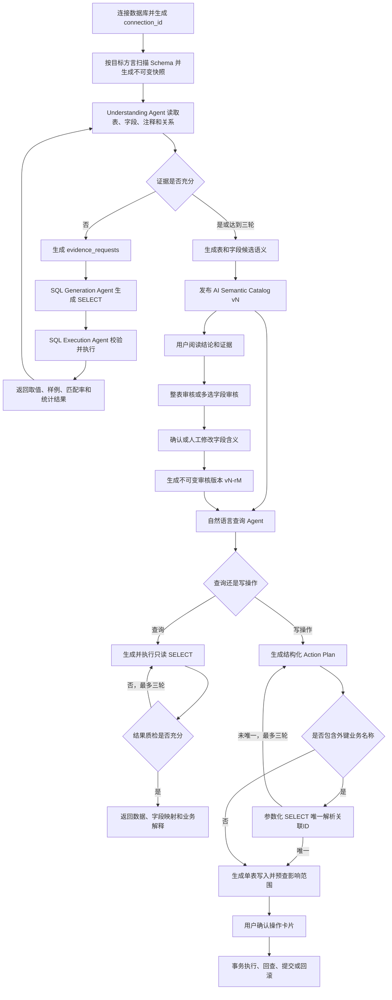

# AI Database Agent

AI Database Agent 用于自动理解陌生企业数据库：读取数据库结构，结合真实数据进行
最多三轮自动取证，生成可追溯的表和字段语义；业务用户可以查看证据、确认整表，
也可以多选字段并直接修订不认可的解释。

项目当前支持 MySQL、PostgreSQL、Microsoft SQL Server 和 Oracle Database，
后端使用 FastAPI，模型服务使用 DeepSeek，并提供本地 Web 工作台。

## 作品展示入口

如果只是想快速查看项目能力，无需配置数据库或 LLM Key：

```bash
./scripts/run-portfolio-demo.sh
```

然后打开 <http://localhost:3000/demo>。该离线演示包含数据库结构扫描、多轮语义取证、NL2SQL 查询和人工确认写操作四个阶段，适合简历附件或面试现场展示。完整说明见 [`docs/portfolio/README.md`](docs/portfolio/README.md)。

## 一、解决什么问题

企业数据库经常存在以下情况：

- 表和字段没有注释；
- 字段名使用缩写，例如 `rq`、`gz`、`rybh`；
- 数据库没有声明外键，但不同表实际使用相同业务编号；
- 数据库注释存在，但不完整或已经过时；
- LLM 只看 Schema 时无法可靠判断编码、手机号、身份证或业务状态值。

本项目不会因为某个字段暂时无法确定就停止。Understanding Agent 可以保留多个候选，
并自主向 SQL Agent 请求数据证据，最多循环三轮后生成当前最佳结论。

## 二、完整业务链路



### Agent 分工

| Agent | 职责 | 不负责 |
| --- | --- | --- |
| Understanding Agent | 综合 Schema、上下文字段、关系和查询证据，生成多候选语义 | 直接连接数据库执行任意 SQL |
| SQL Generation Agent | 按当前连接的数据库方言将证据需求转换为有目的的查询 | 决定最终业务含义 |
| SQL Execution Agent | 校验 SQL 类型并执行有界 SELECT | 生成解释或直接修改数据 |
| Query Agent | 使用有效语义生成查询，并结合真实结果最多三轮取证、质检和重规划 | 修改数据库或把空结果擅自改成非空 |
| Query Result Assessment Agent | 判断结果是否足以回答问题，识别空结果、错误粒度、关联放大和截断 | 生成 SQL 或补造结果 |
| Result Explanation Agent | 根据真实 SQL 结果生成业务回答和数据边界 | 补造结果中不存在的数据 |
| Intent Router Agent | 区分数据查询、查询口径追问和持久化写操作 | 直接执行 SQL |
| Action Planning Agent | 将写入意图转换成单表结构化草案，并声明需要解析的跨表业务值 | 猜测外键ID或重命名关联主数据 |
| Action Lookup Tool | 沿声明外键执行参数化 SELECT，把岗位、部门、客户等名称唯一解析为ID | 执行写入或在多候选时自行猜测 |
| Action Safety Validator | 用确定性规则生成参数化 SQL、检查条件、主键和影响行数 | 依赖 LLM 判断是否安全 |
| Action Execution Agent | 在事务中执行 INSERT、UPDATE、DELETE 并回查 | 执行 DDL 或绕过用户确认 |

## 三、数据库理解输出

每张表的理解结果包含：

- 表摘要、表含义候选、表角色和数据粒度；
- 每个字段最多三个含义候选；
- 字段角色和敏感信息候选；
- 置信度；
- 支持证据和反向证据；
- 自动取证请求、SQL、执行状态和有界结果；
- 完成状态、终止原因及取证轮数；
- 来源快照、模型和 Prompt 版本。

`completed` 表示 Agent 认为关键问题已经收敛；`best_effort` 表示三轮后仍保留歧义，
系统会保存多个最佳候选，但不会阻塞后续功能。

## 四、证据如何展示

语义目录不会默认把 SQL 和 JSON 全部铺在页面上，而是按四层阅读：

1. **结论**：当前表或字段被理解成什么；
2. **为什么**：支持证据、反向证据和置信度；
3. **数据依据**：外键关系、取值分布、跨表匹配和代表性数据；
4. **原始核查信息**：用户主动展开后才显示 SQL 和部分查询结果。

字段的“查看依据”会优先过滤与该字段直接相关的证据。声明外键会明确标记为
“数据库声明的外键关系”；通过数据比对得到的关系会显示对应的查询目的和结果，
避免把推测伪装成数据库约束。

## 五、人工审核与版本规则

人工审核不会覆盖 AI 原始结果，也不会成为查询功能的强制闸门。

### 支持的审核方式

- **单一审核面板**：没有“字段/整表”模式切换，避免重复交互；
- **一键确认整表**：表和全部字段无异议时直接生成完整审核版本；
- **异议字段修订**：只勾选不认可的字段，原位修改含义和业务说明后提交；
- **分批审核**：后一次审核继承同一 AI 版本已经确认的字段；
- **审核说明**：记录审核人和本次业务说明。

### 版本示例

```text
AI v1       第一次自动理解结果
v1-r1       基于 AI v1 的第一次人工审核
v1-r2       在 v1-r1 基础上继续审核或修改
AI v2       Schema 变化或重新理解后产生的新 AI 版本
v2-r1       针对 AI v2 的新审核链
```

审核版本保存：

- 来源 AI 版本和 Schema 指纹；
- 本次提交字段；
- 累计已审核字段；
- 修改前和修改后的含义；
- `confirmed` 或 `edited` 决策；
- 审核人、审核时间和说明；
- 合并后的可用语义结果。

如果页面打开后 AI 版本已经变化，后端会拒绝旧版本审核，要求用户刷新后重新确认。

## 六、前端功能

本地工作台：<http://localhost:3000>

- 配置 MySQL、PostgreSQL、SQL Server、Oracle 连接或使用后端默认连接；
- 扫描数据库并生成结构快照；
- 一键理解全部数据库；
- 每张表独立理解或重新理解；
- 查看 Agent 实时返回的候选和自动取证轨迹。

语义目录：<http://localhost:3000/catalog>

- 查看物理表、字段与业务解释的对应关系；
- 查看 AI 版本、审核版本和审核覆盖状态；
- 按表或字段阅读分层证据；
- 在同一审核面板中一键确认整表，或勾选并修订不认可的字段。

智能查询：<http://localhost:3000/query>

- 输入自然语言业务问题；
- 以对话形式继续增加、删除或替换查询条件；
- 先提取本轮增量意图，再由代码合并指标、时间、过滤条件、事实表和详情要求；
- 省略事实对象的“有多少/详细列出”等表达会强制继承上一目标，完整新问题才切换主题；
- 查询计划执行前校验合并目标，丢失继承项时自动重规划；
- 历史对话按 `session_id` 本地持久化，刷新后恢复最近会话并可切换旧会话；
- 省略年份的月份和日期以当前系统年份为准；
- 人工审核语义优先，未审核字段回退到 AI Catalog；
- 查看业务词到真实字段的映射；
- 按当前数据库方言生成并执行只读 SELECT；
- 每轮 SQL 结果由质检 Agent 判断，最多三轮处理执行失败、空结果、异常粒度、
  字段歧义和候选值取证；
- 每轮默认只展示用户问题和业务回答，其余数据、上下文、SQL与质检过程通过同一个按钮展开；
- 查询过程展示上下文继承、每轮取证/回答计划、质检原因、SQL和语义来源；
- 查询结果表展示本轮完整有界结果，并在固定高度的滚动窗口中阅读；
- 自动区分查询和数据库写操作；
- 写操作展示修改前数据、预计影响行数、安全检查和参数化 SQL；
- 岗位、部门、客户、供应商等跨表业务名称会沿声明外键先查询唯一ID，再生成单表写入；
- 写操作展示只读 lookup SQL、真实候选行、解析结果和规划轮次；
- 用户确认后在事务内执行 INSERT、UPDATE、DELETE，并自动回查。
- 理解或查询节点失败后保留断点，页面可从原 `run_id/query_id` 继续；
- 写操作预览后在原 `action_id` 上暂停，刷新或重启后仍可确认或取消。
- 匿名用户只有查询权限；数据库操作员登录后才能生成、确认或取消写操作。

## 七、工程结构

```text
AI_DB/
├── backend/
│   ├── app/agents/                 # Understanding、SQL生成、SQL执行 Agent
│   ├── app/graphs/
│   │   ├── understanding/          # 理解、取证SQL和三轮证据闭环
│   │   ├── query/                  # 查询规划、执行、质检和重规划
│   │   ├── action/                 # 跨表取值、写入预览、执行与验证
│   │   └── conversation/           # 会话Router、上下文合并和子图调度
│   ├── app/services/               # 快照、理解、Catalog、审核业务编排
│   ├── app/repositories/           # 文件持久化接口与实现
│   ├── app/api/v1/endpoints/       # FastAPI 接口
│   ├── data/snapshots/             # 数据库结构快照
│   ├── data/understanding_runs/    # 完整理解运行与证据
│   ├── data/semantic_catalog/      # AI 当前版本和不可变历史
│   ├── data/semantic_reviews/      # 审核当前版本和不可变历史
│   ├── data/database_queries/      # 查询运行、SQL和结果
│   ├── data/checkpoints/           # LangGraph SQLite checkpoint
│   ├── data/query_sessions/        # 多轮对话状态与结果摘要
│   └── data/database_actions/      # 写操作计划、确认状态与执行审计
├── frontend/
│   ├── app/                        # 本地页面路由
│   ├── components/                 # 工作台、语义目录、证据和审核组件
│   └── lib/                        # API 客户端与前端领域类型
├── DB/mysql/                       # 本地模拟企业 MySQL
├── gateway/                        # 预留：客户环境数据库 Gateway
└── docs/                           # 预留：架构与协议文档
```

依赖方向：

```text
Frontend -> FastAPI Endpoint -> Service -> LangGraph / Agent -> Repository / Adapter
```

Endpoint 不包含 Prompt、审核合并或 SQL 执行业务逻辑。

四条生产主链路均由 LangGraph 编排。

数据库理解：

```text
analyze_schema_and_evidence
→ generate_evidence_sql（按需）
→ execute_evidence_sql（只读）
→ analyze_schema_and_evidence（最多三轮）
→ finalize_understanding
```

自然语言查询：

```text
plan_query
→ execute_select
→ assess_result
→ prepare_replan（按需，最多三轮）
→ explain_result
```

SQL执行失败进入 `record_execution_failure`，达到轮次上限进入 `finalize_failure`。

写操作规划与执行：

```text
load_action_context
→ plan_single_table_action
→ resolve_cross_table_values
→ prepare_action_replan（未唯一时，最多三轮）
→ preview_target_rows
→ await_user_confirmation（interrupt）
→ 用户确认或取消（同一 action_id resume）
→ execute_transaction_and_verify
```

会话父图：

```text
load_conversation_session
→ route_conversation_intent
→ merge_conversation_context
→ query_subgraph / action_subgraph
```

理解运行使用 `run_id`、查询使用 `query_id`、写操作使用 `action_id`，会话父图使用独立
`conversation_*` 标识作为 LangGraph `thread_id`。节点状态分别持久化到：

```text
backend/data/checkpoints/understanding_graph.sqlite
backend/data/checkpoints/query_graph.sqlite
backend/data/checkpoints/action_graph.sqlite
backend/data/checkpoints/conversation_graph.sqlite
```

Graph 只负责编排和状态迁移；Prompt、Pydantic 协议校验、数据库方言 Adapter、参数化
SQL 构造和事务回查继续复用原有实现。旧的 Agent 显式循环仍保留为依赖未注入时的兼容
回退，但 FastAPI 生产依赖默认进入 LangGraph。

## 八、核心 API

### 数据库与快照

```text
GET  /api/v1/database-connections/default/health
POST /api/v1/database-connections/connect
GET  /api/v1/database-connections
POST /api/v1/database-snapshots/connections/{connection_id}/scan
POST /api/v1/database-snapshots/default/scan
GET  /api/v1/database-snapshots/{snapshot_id}
```

### 理解与全库构建

```text
POST /api/v1/database-understanding/snapshots/{snapshot_id}/tables/{table_name}
GET  /api/v1/database-understanding/runs/{run_id}
GET  /api/v1/database-understanding/runs/{run_id}/workflow
POST /api/v1/database-understanding/runs/{run_id}/resume
POST /api/v1/database-understanding/snapshots/{snapshot_id}/catalog-builds
GET  /api/v1/database-understanding/catalog-builds/{job_id}
```

### Semantic Catalog、证据与审核

```text
GET  /api/v1/semantic-catalog/databases/{database}/tables
GET  /api/v1/semantic-catalog/databases/{database}/tables/{table}
GET  /api/v1/semantic-catalog/databases/{database}/tables/{table}/evidence
GET  /api/v1/semantic-catalog/databases/{database}/reviews
GET  /api/v1/semantic-catalog/databases/{database}/tables/{table}/reviews
POST /api/v1/semantic-catalog/databases/{database}/tables/{table}/reviews
```

### 自然语言查询

```text
POST /api/v1/database-query/snapshots/{snapshot_id}
GET  /api/v1/database-query/runs/{query_id}
GET  /api/v1/database-query/runs/{query_id}/workflow
POST /api/v1/database-query/runs/{query_id}/resume
POST /api/v1/database-query/sessions
GET  /api/v1/database-query/sessions
GET  /api/v1/database-query/sessions/{session_id}
POST /api/v1/database-query/sessions/{session_id}/turns
POST /api/v1/database-query/sessions/{session_id}/messages
POST /api/v1/database-query/sessions/{session_id}/runs/{query_id}/resume
GET  /api/v1/database-actions/{action_id}
GET  /api/v1/database-actions/{action_id}/workflow
GET  /api/v1/database-actions?session_id={session_id}
POST /api/v1/database-actions/{action_id}/confirm
POST /api/v1/database-actions/{action_id}/cancel
```

### 本地身份与权限

```text
POST /api/v1/auth/login
GET  /api/v1/auth/me
POST /api/v1/auth/logout
```

当前本地版本提供两个角色：

- `viewer`：匿名只读用户，只能执行数据库查询；
- `database_operator`：登录后可以生成、确认和取消写操作。

操作员会话使用后端签名的 HttpOnly Cookie，前端脚本无法读取。用户名和密码通过
`backend/.env` 中的 `AUTH_OPERATOR_USERNAME`、`AUTH_OPERATOR_PASSWORD` 配置，
写操作审计会记录申请人、确认人或取消人。

请求示例：

```json
{
  "question": "按盘点状态统计盘点记录数量，并说明每个状态代表什么"
}
```

`messages` 接口会先区分查询和写操作。查询响应包含结构化意图、字段映射、语义来源、
最多三轮查询/质检/重规划、有界结果和结果解释；写操作会先完成跨表业务值解析，再返回
待确认 Action Plan，不会立即修改数据。

审核请求示例：

```json
{
  "source_catalog_version": 1,
  "scope": "fields",
  "reviewer": "财务用户A",
  "field_decisions": [
    {
      "column_name": "gz",
      "reviewed_meaning": "实发工资",
      "reviewed_description": "员工本次实际到账的工资金额",
      "source_candidate_index": 0,
      "note": "已与工资条口径核对"
    }
  ],
  "note": "完成工资金额字段审核"
}
```

## 九、本地启动

启动 MySQL：

```bash
cd projects/ai-database-agent/DB/mysql
docker compose up -d
```

启动后端：

```bash
cd projects/ai-database-agent/backend
uv sync
uv run uvicorn app.main:app --reload --host 127.0.0.1 --port 8000
```

启动前端：

```bash
cd projects/ai-database-agent/frontend
npm install
npm run dev
```

后端接口文档：<http://127.0.0.1:8000/docs>

## 十、测试

```bash
cd projects/ai-database-agent/backend
uv run ruff check app tests
uv run pytest

cd projects/ai-database-agent/frontend
npm run lint
npm test
```

## 十一、当前边界

- 已支持 MySQL、PostgreSQL、SQL Server 和 Oracle；SQL Server 运行机器需要安装
  `ODBC Driver 18 for SQL Server`，Oracle 默认使用 `python-oracledb` Thin 模式；
- 每次连接生成 `connection_id`，快照、理解取证、查询、写入、语义目录和对话会话均沿该
  标识解析同一数据库；旧快照只有与默认连接完全一致时才允许执行；
- 连接 Profile 不保存明文密码，凭据单独加密存储在本机 `backend/data/credentials`；
- 查询和理解链路的 SQL Execution Agent 只放行 SELECT，并限制返回行数；
- 写操作仅支持单表 INSERT、UPDATE、DELETE，使用独立 `ai_writer` 账号；
- 单表写入前可以沿数据库声明外键跨表读取并唯一解析业务名称；lookup没有结果或存在
  多个候选时，最多重规划三轮，仍无法唯一解析则阻止写入；
- 影响0行的 UPDATE、DELETE 会在预览阶段阻止确认；
- UPDATE、DELETE 必须带条件，默认最多影响 100 行，并要求目标表有主键以便回查；
- 写操作确认前会锁定并比对完整目标行；目标数量或任意内容变化都会要求重新预览；
- Action 在预览后使用 LangGraph `interrupt/resume`，规划、确认和执行共享同一
  `action_id`；若进程在写事务结果落库前异常退出，系统不会自动重放写入，而会要求人工核对；
- Understanding 和 Query 支持查询 checkpoint 状态并从失败节点显式恢复；恢复不会重新运行
  已成功节点，会话中的失败查询恢复后仍会保存回原会话；
- DROP、TRUNCATE、ALTER、CREATE 和多表写入当前全部禁止；
- 当前审核人是用户输入，尚未接入企业统一身份认证；
- 已支持声明外键和关系类 SQL 取证，但“隐式关系”尚未沉淀为独立关系图谱对象；
- 查询 Agent 已支持结构化增量意图、代码级上下文合并、历史会话恢复和新主题重置，
  但暂未提供会话分支选择和跨会话搜索；
- 查询 Agent 已支持最多三轮的执行失败、空结果、异常结果、字段歧义取证、重规划和
  结果可信度判断；复杂查询成本估算和跨会话搜索仍待完善；
- 当前身份系统是本地单操作员 RBAC，生产环境仍需接入企业 SSO、用户目录和更细权限策略；
- 查询链路尚未加入复杂查询成本估算；
- 当前前端只在本机运行。
